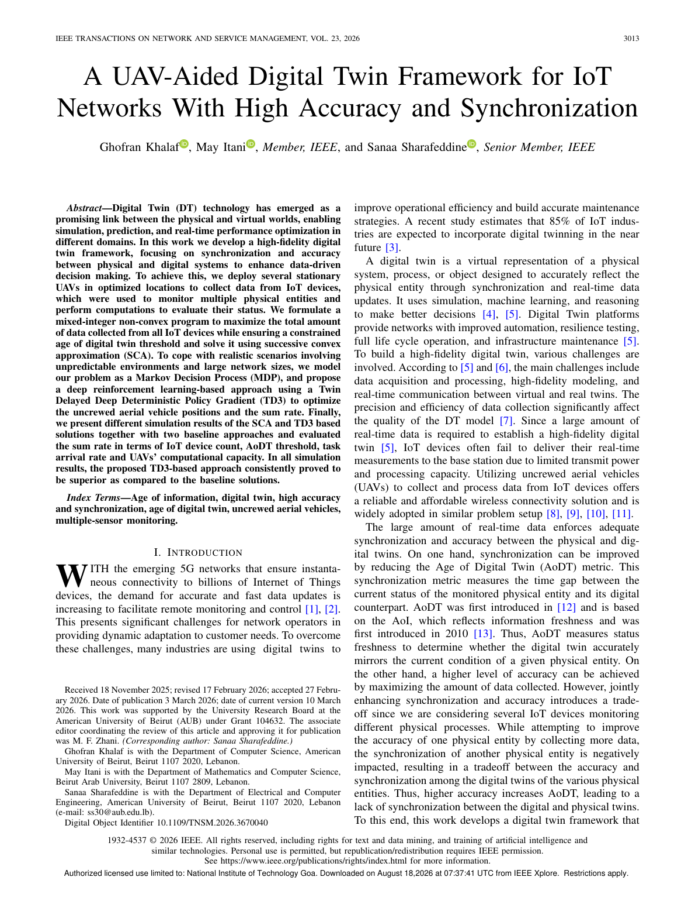
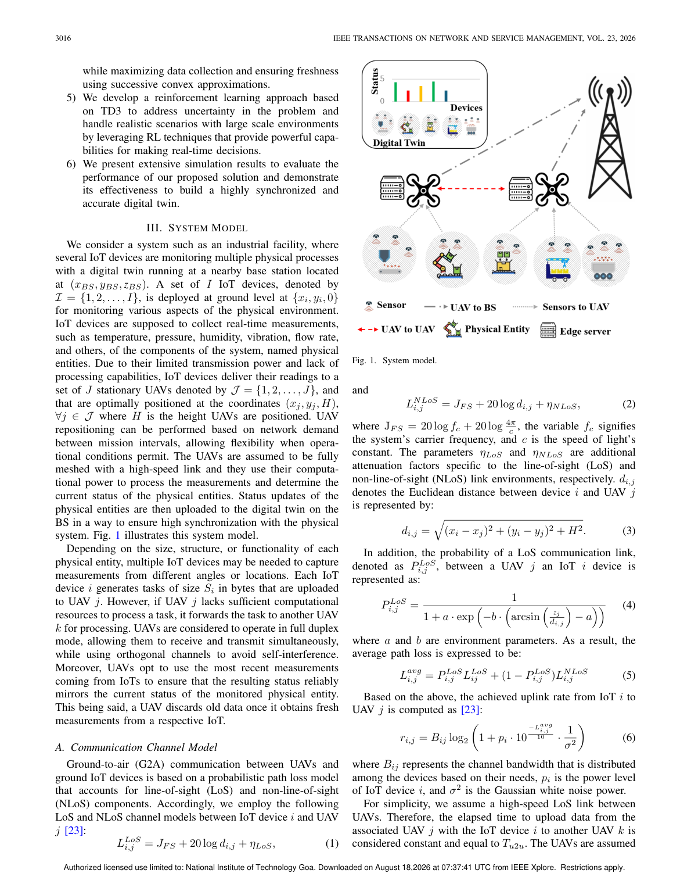
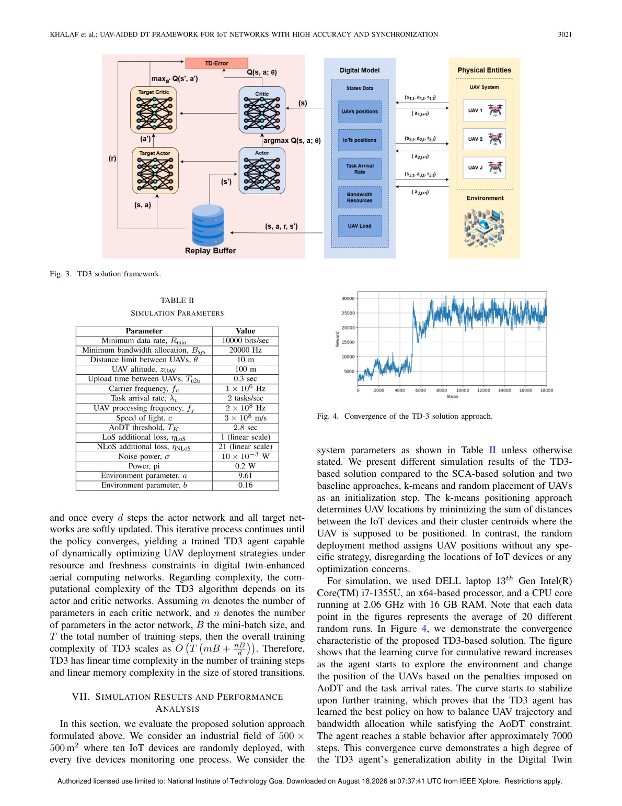
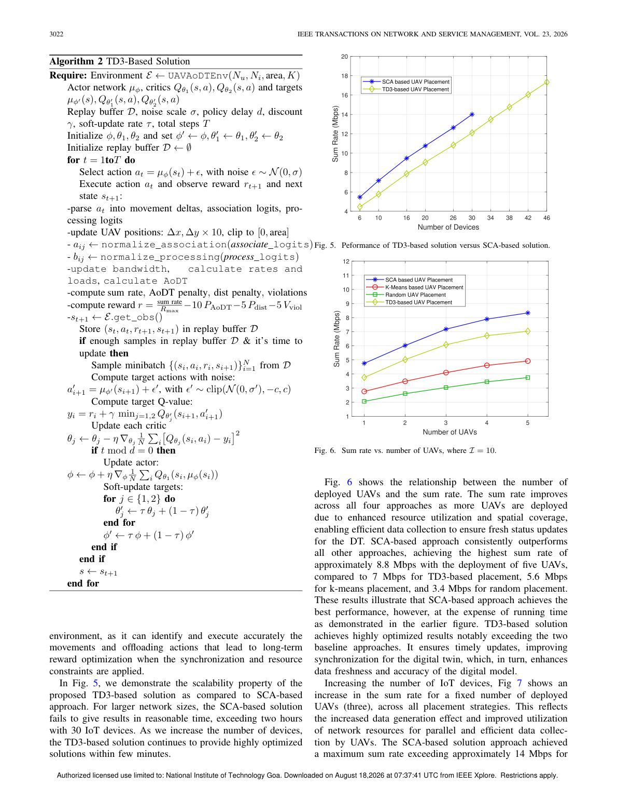
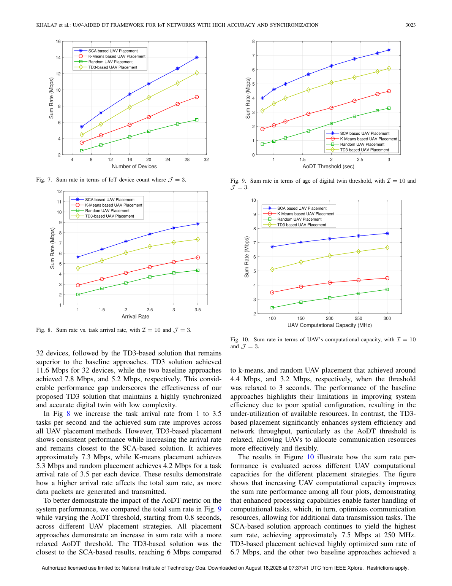
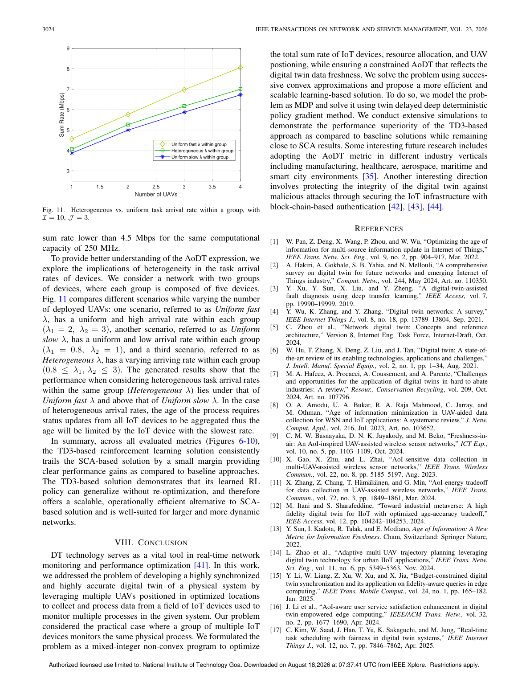
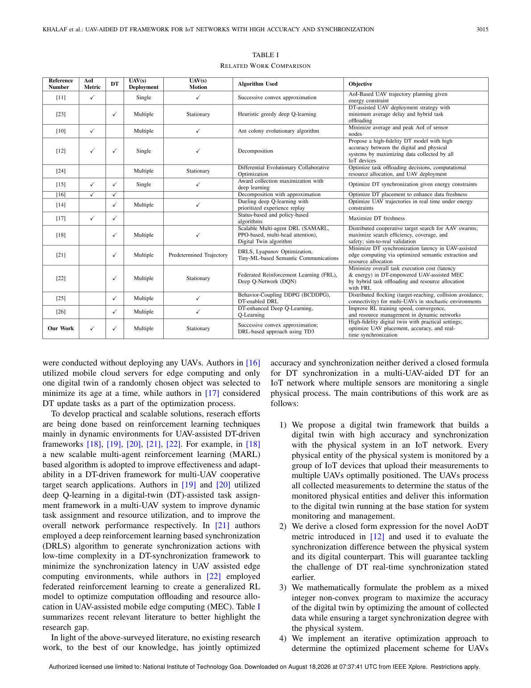

# UAV-Aided Digital Twin: Project Status, Fresh Runs, and Paper Analysis

<!-- AUTO:meta -->
**Last auto-refresh:** 2026-08-31 19:33  
**Repository:** `C:\code\UAV`  
**Paper PDF:** `docs/A_UAV-Aided_Digital_Twin_Framework_for_IoT_Networks_With_High_Accuracy_and_Synchronization.pdf`  
Measured tables below marked `AUTO` are rewritten from CSVs when you run `python -m src.main` (compare / sweeps / aodt-compare / solvers) or `python -m src.status_sync`.
<!-- /AUTO:meta -->

This document has two parts that must not be mixed up.

- **Part A (English)** is an audit of *this* Python reconstruction: what is implemented, what is not, and numbers obtained by actually running the test suite, every solver mode, comparisons, TD3 training, AoDT comparison, radio calibration, and paper-style parameter sweeps (J, I from `aodt-compare` with TD3; λ, \(T_k\), \(f_j\) from a 20-seed constraint sweep without per-cell TD3 retraining).
- **Part B (Chinese)** is a paper-analysis of Khalaf, Itani, and Sharafeddine, *IEEE Transactions on Network and Service Management*, vol. 23, pp. 3013–3025, 2026. Every numerical claim in Part B is taken from the IEEE PDF (or, where noted, from arXiv:2504.15967v1 / the September 2025 AUB M.S. thesis). Nothing in Part B is invented from this repo’s outputs.

**Machine used for the Part A runs:** Python 3.11.9, PyTorch 2.11.0+cu128, NVIDIA GeForce RTX 5070 Laptop GPU

Absolute rates in Part A always name the radio profile. **`calibrated` is not Table II.** Literal Table II is `--radio-profile table2`.

---

## Executive snapshot

The reconstruction is a working common evaluator for Problem (P) with Random, K-means, placement PSO, joint PSO, a Python SCA surrogate, and TD3. The proposed/novel method is still `NotImplementedError`.

<!-- AUTO:snapshot -->
Last auto-refresh **2026-08-31 19:33**. Test functions currently in `tests/`: **71**.

Rankings below are recomputed from the newest matching CSVs under `results/`. Absolute rates use the **calibrated** radio unless a table says `table2`.

- `compare --paper-runs` (20 seeds, placement PSO): **PSO** lead: PSO 7.588 > SCA 7.143 > TD3 6.512 > K-means 6.429 > Random 3.812 Mbps
- `compare` 5-seed (placement PSO): **PSO** lead: PSO 7.681 > SCA 7.374 > K-means 6.739 > TD3 6.739 > Random 5.007 Mbps
- `aodt-compare` default I=10 J=3 (joint PSO, pooled TD3): **SCA** lead: SCA 7.143 > TD3 6.512 > K-means 6.429 > PSO-joint 4.959 > Random 3.812 Mbps
<!-- /AUTO:snapshot -->

The IEEE paper’s Fig. 6 at five UAVs quotes SCA ≈ **8.8 Mbps**, TD3 ≈ **7 Mbps**, K-means ≈ **5.6 Mbps**, random ≈ **3.4 Mbps**. This repo’s AoDT J-sweep at five UAVs is SCA **8.025**, TD3 **7.665**, K-means **7.811**, random **6.116**. The SCA-over-TD3-over-random order matches the paper; K-means is much stronger here because every method shares the same bandwidth LP and per-link cap.

The IEEE **abstract** says TD3 “consistently proved to be superior as compared to the baseline solutions.” The IEEE **body** (pp. 3022–3024) says SCA outperforms TD3 on every sum-rate figure, with TD3 second. That contradiction is in the paper, not in this repo.

Paper-style axes: **J and I** (Figs. 6–7 analogues) come from `aodt-compare` with pooled TD3. **λ, \(T_k\), \(f_j\)** (Figs. 8–10 analogues) come from a 20-seed `--compute` sweep of Random / K-means / placement PSO / SCA (no per-cell TD3) in `results/run_20260831/sweeps_constraints/`. Full per-cell TD3 retraining for **all** sweep axes (including λ, \(T_k\), \(f_j\)) finished in `results/run_20260831/sweeps/` on 31 August 2026 (~6 h wall time on RTX 5070).

Eval-time k-means RNG for TD3 was aligned with `solve_kmeans` (`docs/td3_fidelity_notes.md`). The 31 August batch under `results/run_20260831/` is the canonical Part A run set; AUTO tables prefer those CSVs when present.

---

# Part A — Implementation status and measured results

## 1. What this repository is

The project goal, stated in `docs/plan.md`, is to treat the paper’s Problem (P) as a **shared mathematical problem** and compare solvers against one evaluator:

```text
Scenario  →  Common environment  →  Common evaluator  →  Random / K-means / PSO / SCA / TD3 / Proposed
```

`src/evaluator.py` is that evaluator. Every solver is required to call `evaluate(...)`. Tests in `tests/test_evaluator.py` pin that Random, K-means, PSO, and SCA return the same `EvalResult` type.

### 1.1 Implemented

| Piece | Location | Notes |
|---|---|---|
| Table II constants + two radio profiles | `src/config.py` | Default profile is `calibrated`, not `table2` |
| Scenario generator (500×500 m², process groups) | `src/scenario.py` | Seeds 100–119 for paper-style runs |
| Eqs. (1)–(6) G2A channel | `src/comm.py` | LoS angle unit is a config flag (`deg` default) |
| Eqs. (7)–(9) M/M/1 | `src/compute.py` | Needs experimental `L` |
| Eqs. (11), (13), (16), (17) AoDT | `src/aodt.py` | Needs experimental `S_i` |
| Repair: association, process-consistent processing, bandwidth LP, separation | `src/repair.py` | Includes non-paper per-link cap |
| Random / K-means | `src/solvers/random.py`, `kmeans.py` | Placement only; repair fills the rest |
| PSO placement and joint PSO | `src/solvers/pso.py` | `w=0.7`, `c1=c2=1.5`, 20×100; not Table II |
| SCA surrogate | `src/solvers/sca.py` | Trust-region finite differences + exact bandwidth LP. **Not** MATLAB CVX+MOSEK |
| TD3 (Alg. 2 structure) | `src/solvers/td3.py` | Actor/critic on CUDA when available; simulator on CPU |
| CLI | `src/main.py` | Modes listed in `README.md` |
| Sweeps / AoDT compare | `src/experiments/` | Paper Figs. 6–10 axes |

### 1.2 Not implemented or not paper-faithful

| Gap | Status |
|---|---|
| **Proposed method** | `src/solvers/proposed.py` raises `NotImplementedError`. Confirmed this run (exit code 1). The docstring still says “until … share one evaluator”; they already do. |
| **SCA** | Paper: CVX/MOSEK on a convexified (P). Repo: numerical gradient on the true evaluator with binaries refreshed after each step. |
| **`S_i`, `L`** | Absent from Table II. Experimental defaults 2000 bytes and 2×10⁶ cycles, only with `--compute` / `aodt-compare`. |
| **`B_sys = 20 kHz` as published Mbps** | Impossible under Eq. (6); see §1.3. |
| **Per-link bandwidth cap 0.25** | Modelling addition, not in (P). |
| **TD3 hyperparameters** | Alg. 2 gives the *form* of reward `sum_rate/R_max − 10 P_AoDT − 5 P_dist − 5 V_viol` and `Δx,Δy × 10`. `R_max=1e6`, hidden size 256, 7000 steps, episode length 50, association action scale 0.25 are repo choices. Reported TD3 is **greedy-policy evaluation**, not the training-search archive. |
| **Official paper code** | None found on GitHub. |

### 1.3 Radio profiles (why default is not Table II)

Table II lists noise power `σ = 10×10⁻³ W` and a 20 000 Hz bandwidth row (IEEE PDF Table II, p. 3021; the arXiv table labels the same 20 000 Hz row `B_min`). Eq. (6) uses `σ²`. Literal `table2` therefore sets `noise_power = (0.01)² = 10⁻⁴ W` and `B_sys = 20 kHz`.

On that channel the Shannon bound of the **entire system** is about **0.13 Mbps** (one link, IoT under the UAV, all 20 kHz). IEEE Figs. 6–10 are in the 3–14 Mbps range. That is not a solver bug; it is a parameter/figure inconsistency in the paper. Documented in `docs/calibration.md`.

| Knob | `table2` | `calibrated` (default) |
|---|---|---|
| `b_sys` | 20 000 Hz | 8.8×10⁶ Hz (fitted scale) |
| `noise_power` | `σ² = 10⁻⁴ W` | `σ = 0.01 W` (table *label* as Eq. (6)’s `σ²`) |
| `max_bw_share` | none | 0.25 |
| Constraint (28) / (27) in IEEE numbering | system-wide pool | system-wide pool |

This run’s calibration script reproduced that split (see §6).

---

## 2. Test suite

<!-- AUTO:tests -->
Command: `python -m pytest -v --tb=short`  
Collected test functions in `tests/test_*.py`: **71**. Re-run pytest locally to confirm they still pass; this cell counts definitions, not a live pytest session.
<!-- /AUTO:tests -->

| File | What it pins |
|---|---|
| `tests/test_comm.py` | Radio-profile knobs; frozen scenario determinism; rate ∝ bandwidth; `P_LoS ∈ [0,1]` |
| `tests/test_evaluator.py` | Shared evaluator; association; process consistency; Eq. (17) when compute is on; PSO vs random |
| `tests/test_repair.py` | Bandwidth pools, floors, caps, per-UAV scope, QoS shortfall |
| `tests/test_sca.py` | Vertex vs cap; frozen binaries while probing; separation |
| `tests/test_aodt_binding.py` | AoDT can violate on poor placement; present after repair |
| `tests/test_sweep_constraints.py` | `λ`, `T_k`, `f_j` must change **allocation/feasibility**, not Shannon |
| `tests/test_td3.py` | Alg. 2 action parse; greedy eval ≠ training archive; CUDA auto; overflow bandwidth |
| `tests/test_positions.py` | UAV JSON encode/expand |
| `tests/test_status_sync.py` | Status-doc AUTO tables, paper columns, CSV aggregation |

During this audit, `aodt-compare` initially crashed with `UnboundLocalError` in `src/experiments/aodt_compare.py` (`log` shadowed by the TD3 train-log return). The local binding is now `train_log`. After that fix, the full 20-seed AoDT comparison completed.

---

## 3. Smoke: one scenario, seed 100, I=10, J=3 unless noted

All times wall-clock on this machine. Radio is `calibrated` unless stated.

| Mode | Compute | Result | Feasible | Time |
|---|---|---|---|---|
| `single` (frozen UAV at (250,250,100)) | off | sum rate **1.582 Mbps**, `qos=2` | no | 1.7 s |
| `single --compute` | on | **2.355 Mbps**, `qos=0`, `aodt_viol=0` | yes | 1.7 s |
| `single --radio-profile table2` | off | **0.055 Mbps**, `qos=9` | no | 1.7 s |
| `random` | off | **2.998 Mbps**, `qos=1` | no | 1.7 s |
| `kmeans` | off | **5.124 Mbps**, `qos=0` | yes | 1.7 s |
| `pso` (20×100, placement) | off | **5.612 Mbps**, `qos=0` | yes | 2.1 s |
| `pso-joint` | off | **5.551 Mbps**, `qos=0` | yes | 2.1 s |
| `sca` | off | **7.742 Mbps**, `qos=0` | yes | 1.7 s |
| `td3 --td3-steps 7000` | off | **5.517 Mbps**, `qos=0`, greedy 5 restarts | yes | **34 s** (train ~32 s on RTX 5070) |
| `proposed` | off | `NotImplementedError` | — | exit 1 |
| `pso --compute` | on | **7.925 Mbps**, AoDT = [2.45, 2.15] s | yes | 2.3 s |
| `sca --compute` | on | **7.742 Mbps**, AoDT = [2.15, 2.45] s | yes | 1.7 s |

TD3 device log line: `cuda (NVIDIA GeForce RTX 5070 Laptop GPU)`. Paper simulations used a DELL i7-1355U, 16 GB RAM, no GPU stated (IEEE p. 3021).

Turning compute on **raised placement-PSO** from 5.612 to 7.925 Mbps on the same seed because `complete_solution` switches from equal bandwidth split to the constrained LP (R_min / AoDT floors, then surplus). SCA was already using that LP, so it stayed at 7.742 Mbps.

---

## 4. Method comparison (fresh, 31 August 2026)

Output directory: `results/run_20260831/`.

### 4.1 Dev set: 5 seeds (100–104), calibrated, `--compute --with-td3`

Each TD3 column is **one trained policy per seed**, then greedy eval (~35 s/seed). Paper column is the IEEE Fig. 6 read at **J=3** (approximate; paper protocol is 20 runs).

<!-- AUTO:compare_5 -->
| Method | Repo (Mbps) | Paper Fig. 6 at J=3 (Mbps) | Feasible fraction | AoDT mean (s) | QoS | Runtime (s) | Std (bit/s) |
|---|---:|---:|---:|---:|---:|---:|---:|
| Random | 5.007 | ~3 | 0.80 | 2.474 | 0.20 | 0.002 | 1.85e+06 |
| K-means | 6.739 | ~4 | 1.00 | 2.390 | 0.00 | 0.001 | 7.30e+05 |
| PSO (placement) | 7.681 | n/a | 1.00 | 2.360 | 0.00 | 0.612 | 2.26e+05 |
| SCA | 7.374 | ~7.1 | 1.00 | 2.390 | 0.00 | 0.046 | 3.07e+05 |
| TD3 | 6.739 | ~5.8 | 1.00 | 2.390 | 0.00 | 42.091 | 7.30e+05 |
| proposed | — | n/a | — | — | — | — | — |

_Paper protocol is 20 runs; this table is the 5-seed dev set. Paper column is still the Fig. 6 J=3 read._
_Source: `results/run_20260831/compare_5seed/compare_raw.csv` (mtime 2026-08-31 13:37). Paper columns are IEEE TNSM 2026 §VII figure reads (approximate). PSO is not in the paper._
<!-- /AUTO:compare_5 -->

### 4.2 Paper set: 20 seeds (100–119), calibrated, `--compute --with-td3`

This is the protocol the paper states for plotted points (“average of 20 different random runs”, IEEE p. 3021). Paper column: Fig. 6 at J=3 (approximate figure read). PSO is not a paper method.

<!-- AUTO:compare_20 -->
| Method | Repo (Mbps) | Paper Fig. 6 at J=3 (Mbps) | Feasible fraction | AoDT mean (s) | QoS | Runtime (s) | Std (bit/s) |
|---|---:|---:|---:|---:|---:|---:|---:|
| Random | 3.812 | ~3 | 0.40 | 2.902 | 0.85 | 0.001 | 1.92e+06 |
| K-means | 6.429 | ~4 | 1.00 | 2.375 | 0.00 | 0.001 | 6.90e+05 |
| PSO (placement) | 7.588 | n/a | 1.00 | 2.420 | 0.00 | 0.591 | 3.08e+05 |
| SCA | 7.143 | ~7.1 | 1.00 | 2.375 | 0.00 | 0.040 | 4.79e+05 |
| TD3 | 6.512 | ~5.8 | 1.00 | 2.375 | 0.00 | 39.197 | 6.82e+05 |
| proposed | — | n/a | — | — | — | — | — |

_Source: `results/run_20260831/compare_20seed/compare_raw_20runs.csv` (mtime 2026-08-31 13:50). Paper columns are IEEE TNSM 2026 §VII figure reads (approximate). PSO is not in the paper._
<!-- /AUTO:compare_20 -->

On this reconstruction, **placement PSO beats SCA** on the 20-seed mean. That is allowed: the repo SCA is not the paper’s CVX solver, and PSO searches the same true evaluator SCA linearises. IEEE Fig. 6 has no PSO column.

### 4.3 Literal Table II radio, 5 seeds, `--radio-profile table2 --compute --with-td3`

<!-- AUTO:compare_table2 -->
| Method | Repo (Mbps) | Paper Figs. 6–10 | Feasible | AoDT mean (s) | QoS | Runtime (s) |
|---|---:|---|---:|---:|---:|---:|
| Random | 0.083 | not comparable | 0.00 | 47.960 | 2.00 | 0.002 |
| K-means | 0.099 | not comparable | 0.40 | 2.846 | 0.60 | 0.001 |
| PSO | 0.109 | not comparable | 0.80 | 2.474 | 0.20 | 0.526 |
| SCA | 0.100 | not comparable | 0.40 | 2.730 | 0.60 | 0.042 |
| TD3 | 0.100 | not comparable | 0.60 | 2.816 | 0.40 | 30.276 |

Literal Table II radio sits in a **~0.08–0.11 Mbps** band. IEEE Figs. 6–10 are several Mbps; do not compare those paper numbers to this table.
_Source: `results/run_20260831/table2_5seed/compare_raw.csv` (mtime 2026-08-31 13:53). Paper columns are IEEE TNSM 2026 §VII figure reads (approximate). PSO is not in the paper._
<!-- /AUTO:compare_table2 -->

---

## 5. AoDT comparison (fresh)

Command: `python -m src.main --mode aodt-compare --particles 20 --iters 100 --td3-steps 7000 --out results/run_20260831`  
Always forces `--compute`. PSO is **joint**. TD3 is **one policy per (I, J)** trained on seeds **200–219**, then greedy-evaluated on 100–119. Wall time: **427 s** (31 August 2026 run).

### 5.1 Default I=10, J=3

<!-- AUTO:aodt_default -->
| Method | Repo raw (Mbps) | Paper Fig. 6 at J=3 (Mbps) | Feasible frac | AoDT mean (s) | QoS | AoDT viol | Runtime (s) |
|---|---:|---:|---:|---:|---:|---:|---:|
| Random | 3.812 | ~3 | 0.40 | 2.902 | 0.85 | 0.40 | 0.000 |
| K-means | 6.429 | ~4 | 1.00 | 2.375 | 0.00 | 0.00 | 0.000 |
| PSO joint | 4.959 | n/a | 1.00 | 1.008 | 0.00 | 0.00 | 0.529 |
| SCA | 7.143 | ~7.1 | 1.00 | 2.375 | 0.00 | 0.00 | 0.036 |
| TD3 | 6.512 | ~5.8 | 1.00 | 2.375 | 0.00 | 0.00 | 0.095 |

_Source: `results/run_20260831/aodt/raw_default.csv` (mtime 2026-08-31 13:54). Paper columns are IEEE TNSM 2026 §VII figure reads (approximate). PSO is not in the paper._
<!-- /AUTO:aodt_default -->

Joint PSO’s extra discrete variables hurt the sum-rate mean relative to placement PSO in §4.2, but it records the **lowest AoDT**.

### 5.2 Versus number of UAVs J (I=10) — paper Fig. 6 analogue

Values are mean raw sum rate in Mbps over 20 seeds. Paper columns are IEEE Fig. 6 reads (J=5 printed; J=3 approximate).

<!-- AUTO:aodt_vs_j -->
| J | Random | K-means | PSO | SCA | TD3 | Paper SCA | Paper TD3 | Paper K-means | Paper Random |
|---:|---:|---:|---:|---:|---:|---:|---:|---:|---:|
| 1 | 0.431 | 2.417 | 0.945 | 2.720 | 2.196 | — | — | — | — |
| 2 | 2.169 | 4.882 | 3.071 | 5.945 | 4.855 | — | — | — | — |
| 3 | 3.812 | 6.429 | 4.959 | 7.143 | 6.512 | ~7.1 | ~5.8 | ~4 | ~3 |
| 4 | 5.194 | 7.218 | 5.790 | 7.592 | 7.218 | — | — | — | — |
| 5 | 6.116 | 7.811 | 6.619 | 8.025 | 7.811 | ~8.8 | ~7 | ~5.6 | ~3.4 |

Paper quotes **J=5** in the IEEE text. J=3 paper cells are the audit’s Fig. 6 read (not a printed table).
_Source: `results/run_20260831/aodt/summary_vs_uav.csv` (mtime 2026-08-31 13:57). Paper columns are IEEE TNSM 2026 §VII figure reads (approximate). PSO is not in the paper._
<!-- /AUTO:aodt_vs_j -->

### 5.3 Versus number of IoTs I (J=3) — paper Fig. 7 analogue

<!-- AUTO:aodt_vs_i -->
| I | Random | K-means | PSO | SCA | TD3 | Paper SCA | Paper TD3 | Paper K-means | Paper Random |
|---:|---:|---:|---:|---:|---:|---:|---:|---:|---:|
| 10 | 3.812 | 6.429 | 4.959 | 7.143 | 6.512 | — | — | — | — |
| 16 | 2.626 | 6.279 | 4.079 | 6.987 | 6.299 | — | — | — | — |
| 20 | 2.456 | 6.374 | 4.084 | 7.006 | 6.231 | — | — | — | — |
| 24 | 1.985 | 6.455 | 3.773 | 7.022 | 6.455 | — | — | — | — |
| 32 | 1.505 | 6.087 | 3.345 | 6.582 | 6.087 | ~14 | ~11.6 | ~7.8 | ~5.2 |

Paper quotes **I=32** (Fig. 7). A shared `B_sys` simplex does not make this repo’s sum rate grow with I.
_Source: `results/run_20260831/aodt/summary_vs_iot.csv` (mtime 2026-08-31 14:00). Paper columns are IEEE TNSM 2026 §VII figure reads (approximate). PSO is not in the paper._
<!-- /AUTO:aodt_vs_i -->

### 5.4 Placement geometry (I=10, J=3, seeds 100–119)

From `results/run_20260831/aodt/placement_analysis.md` (Hungarian match to K-means centroids):

| Method | Mean UAV spread (m) | Distance to IoT centroids (m) | Feasible-placement rate | Sum rate (bit/s) |
|---|---:|---:|---:|---:|
| Random | 279.1 | 166.3 | 0.40 | 3 811 600.9 |
| K-means | 297.3 | 0.0 | 1.00 | 6 428 858.5 |
| PSO joint | 297.7 | 84.0 | 1.00 | 4 958 536.8 |
| SCA | 296.9 | 32.1 | 1.00 | 7 142 784.6 |
| TD3 | 299.7 | 116.4 | 1.00 | 6 707 865.4 |

SCA stays close to the IoT centroids (32 m); TD3 sits farther (116 m) but still fully feasible.

Figures written from the same CSVs:


---

## 6. Radio calibration (fresh)

`python -m scripts.calibrate --methods random kmeans sca --js 1 3 5`  
Seeds 100–104. Mean sum rate in Mbps; `f=` is feasible fraction.

**Default calibrated profile** (`B=8.8e6`, `N=0.01`, system pool, cap 0.25):

| J | random | kmeans | sca | Paper Fig. 6 (SCA / TD3 / KM / random) |
|---:|---|---|---|---|
| 1 | 1.678 f=0.0 | 1.499 f=0.2 | 3.060 f=1.0 | — |
| 3 | 3.279 f=0.6 | 4.781 f=1.0 | 7.374 f=1.0 | ~7.1 / ~5.8 / ~4.0 / ~3.0 |
| 5 | 4.133 f=0.8 | 6.833 f=1.0 | 8.062 f=1.0 | **~8.8 / ~7 / ~5.6 / ~3.4** |

**Literal Table II** (`B=20000`, `N=1e-4`, system, no cap):

| J | random | kmeans | sca |
|---:|---|---|---|
| 1 | 0.048 f=0.0 | 0.058 f=0.0 | 0.066 f=0.0 |
| 3 | 0.083 f=0.0 | 0.105 f=0.0 | 0.100 f=0.4 |
| 5 | 0.100 f=0.0 | 0.123 f=0.8 | 0.124 f=1.0 |

Matches `docs/calibration.md`.

---

## 7. Paper-style sweeps (`--mode sweeps`)

Command:

```bash
python -m src.main --mode sweeps --paper-runs --compute --with-td3 --particles 20 --iters 100 --td3-steps 7000 --out results/run_20260831/sweeps
```

This is the job in `todo.md`. It trains one 7000-step TD3 policy **per scenario seed per sweep cell**.

### 7.1 Default comparison (finished)

Same 20 seeds and placement PSO as §4.2. File: `results/run_20260831/sweeps/comparison_table.md`.

<!-- AUTO:sweeps_default -->
| Method | Repo (Mbps) | Paper Fig. 6 at J=3 (Mbps) | Feasible fraction | AoDT mean (s) | QoS | Runtime (s) | Std (bit/s) |
|---|---:|---:|---:|---:|---:|---:|---:|
| Random | 3.812 | ~3 | 0.40 | 2.902 | 0.85 | 0.001 | 1.92e+06 |
| K-means | 6.429 | ~4 | 1.00 | 2.375 | 0.00 | 0.000 | 6.90e+05 |
| PSO (placement) | 7.588 | n/a | 1.00 | 2.420 | 0.00 | 0.535 | 3.08e+05 |
| SCA | 7.143 | ~7.1 | 1.00 | 2.375 | 0.00 | 0.037 | 4.79e+05 |
| TD3 | 6.512 | ~5.8 | 1.00 | 2.375 | 0.00 | 30.658 | 6.82e+05 |
| proposed | — | n/a | — | — | — | — | — |

_Source: `results/run_20260831/sweeps/raw_default_comparison.csv` (mtime 2026-08-31 14:14). Paper columns are IEEE TNSM 2026 §VII figure reads (approximate). PSO is not in the paper._
<!-- /AUTO:sweeps_default -->

PSO seed-100 convergence CSV: `results/run_20260831/sweeps/pso_convergence.csv` (fitness rises from 6.760 Mbps at iter 0 to 7.294 Mbps by iter 2 on that seed, then continues).

### 7.2 J and I with TD3 (finished via `aodt-compare`)

Those axes are §5.2–5.3. They already include TD3 (one policy per \((I,J)\), trained on seeds 200–219). Placement-PSO + per-seed TD3 J/I CSVs from `--mode sweeps --with-td3` are in `results/run_20260831/sweeps/sumrate_vs_{uav,iot}.csv`.

### 7.3 λ, \(T_k\), \(f_j\) without per-cell TD3 (finished)

Command (20 seeds 100–119, calibrated, `--compute`, placement PSO, no TD3):

```bash
# equivalent of sweeps Fig.8–10 only
python -c "… sweep_lambda / sweep_aodt / sweep_cpu …"
```

Output: `results/run_20260831/sweeps_constraints/`. Wall time **191 s** (31 August 2026).

**Fig. 8 analogue — task arrival rate \(\lambda\) (Mbps, 20-seed mean).** Paper at \(\lambda=3.5\): TD3 ≈ 7.3, K-means ≈ 5.3, random ≈ 4.2.

<!-- AUTO:sweeps_lambda -->
| $\lambda$ | Random | K-means | PSO | SCA | Paper SCA | Paper TD3 | Paper K-means | Paper Random |
|---:|---:|---:|---:|---:|---:|---:|---:|---:|
| 1 | 3.788 | 6.425 | 7.464 | 7.034 | — | — | — | — |
| 1.5 | 3.812 | 6.429 | 7.587 | 7.143 | — | — | — | — |
| 2 | 3.812 | 6.429 | 7.588 | 7.143 | — | — | — | — |
| 2.5 | 3.812 | 6.429 | 7.588 | 7.143 | — | — | — | — |
| 3 | 3.812 | 6.429 | 7.588 | 7.143 | — | — | — | — |
| 3.5 | 3.812 | 6.429 | 7.588 | 7.143 | 8.9 (arXiv) | ~7.3 | ~5.3 | ~4.2 |

Paper quote is at $\lambda=3.5$. SCA 8.9 Mbps is the arXiv (no-TD3) optimized line.
_Source: `results/run_20260831/sweeps_constraints/sumrate_vs_lambda.csv` (mtime 2026-08-31 14:01). Paper columns are IEEE TNSM 2026 §VII figure reads (approximate). PSO is not in the paper._
<!-- /AUTO:sweeps_lambda -->


**Fig. 9 analogue — AoDT threshold \(T_k\) (Mbps).** Paper at \(T_k=3\) s: TD3 ≈ 6, K-means ≈ 4.4, random ≈ 3.2 (SCA highest; arXiv without TD3 wrote optimized ≈ 7.8).

<!-- AUTO:sweeps_tk -->
| $T_k$ (s) | Random | K-means | PSO | SCA | Paper SCA | Paper TD3 | Paper K-means | Paper Random |
|---:|---:|---:|---:|---:|---:|---:|---:|---:|
| 0.8 | 2.199 | 4.630 | 5.106 | 4.866 | — | — | — | — |
| 1.2 | 2.625 | 6.080 | 7.125 | 6.614 | — | — | — | — |
| 1.6 | 3.199 | 6.311 | 7.424 | 6.893 | — | — | — | — |
| 2 | 3.632 | 6.399 | 7.479 | 6.993 | — | — | — | — |
| 2.4 | 3.804 | 6.428 | 7.522 | 7.140 | — | — | — | — |
| 2.8 | 3.812 | 6.429 | 7.588 | 7.143 | — | — | — | — |
| 3 | 3.812 | 6.429 | 7.588 | 7.143 | 7.8 (arXiv) | ~6 | ~4.4 | ~3.2 |

Paper quote is at $T_k=3$ s. SCA 7.8 Mbps is the arXiv optimized line.
_Source: `results/run_20260831/sweeps_constraints/sumrate_vs_aodt.csv` (mtime 2026-08-31 14:02). Paper columns are IEEE TNSM 2026 §VII figure reads (approximate). PSO is not in the paper._
<!-- /AUTO:sweeps_tk -->


**Fig. 10 analogue — UAV CPU \(f_j\) (Mbps).** Paper at 250 MHz: SCA ≈ 7.5, TD3 ≈ 6.7, baselines **< 4.5**.

<!-- AUTO:sweeps_cpu -->
| $f_j$ (Hz) | Random | K-means | PSO | SCA | Paper SCA | Paper TD3 | Paper K-means | Paper Random |
|---:|---:|---:|---:|---:|---:|---:|---:|---:|
| 1.0e+08 | 3.812 | 6.429 | 7.588 | 7.143 | — | — | — | — |
| 1.5e+08 | 3.812 | 6.429 | 7.588 | 7.143 | — | — | — | — |
| 2.0e+08 | 3.812 | 6.429 | 7.588 | 7.143 | — | — | — | — |
| 2.5e+08 | 3.812 | 6.429 | 7.588 | 7.143 | ~7.5 | ~6.7 | <4.5 | <4.5 |

Paper quote is at 250 MHz: SCA ~7.5, TD3 ~6.7, baselines <4.5.
_Source: `results/run_20260831/sweeps_constraints/sumrate_vs_cpu.csv` (mtime 2026-08-31 14:03). Paper columns are IEEE TNSM 2026 §VII figure reads (approximate). PSO is not in the paper._
<!-- /AUTO:sweeps_cpu -->


### 7.4 Full per-cell TD3 sweep (finished)

`--mode sweeps --paper-runs --with-td3` retrains 7000-step TD3 **once per seed per cell** on all axes (default, J, I, λ, \(T_k\), \(f_j\)). Outputs: `results/run_20260831/sweeps/sumrate_vs_{uav,iot,lambda,aodt,cpu}.csv` plus `meta.json` (20 seeds, all five methods). Wall time **~5 h 27 min** on RTX 5070 (14:03–19:30, 31 August 2026). Default comparison matches §4.2. J/I TD3 with pooled training remains in §5; λ/\(T_k\)/\(f_j\) **without** per-cell TD3 (paper-style constraint axes) stays in §7.3.

---

## 8. Mapping: paper claim vs this code

| Paper (IEEE TNSM 2026) | This repo |
|---|---|
| Objective (20): max Σ a_ij r_ij | `EvalResult.sum_rate` |
| SCA via MATLAB CVX+MOSEK, Alg. 1 | Python trust-region SCA |
| TD3 Alg. 2, 7000-step convergence (Fig. 4) | Implemented; 7000 steps default; **greedy eval** reported |
| Baselines: random, K-means | Same names; repair + shared evaluator |
| PSO | Extra method, not in the paper |
| Proposed novelty | Empty on purpose |
| 20 random runs | `--paper-runs` / aodt-compare default |
| Table II 20 kHz, σ = 0.01 W | `table2` vs `calibrated` |
| S_i, L unspecified | Experimental, opt-in |
| Fig. 5: SCA >2 h at 30 IoTs | This SCA is ~0.05 s; not the paper solver |
| Fig. 11 heterogeneous λ | No dedicated CLI mode |

---

## 9. Phase checklist from `docs/plan.md` §15

| Item | Status after this audit |
|---|---|
| Parameter document, skeleton, scenario, channel, single-position eval | Done |
| One-UAV and multi-UAV PSO | Done |
| Bandwidth optimization | Done (LP + optional cap) |
| AoDT + CPU stability | Done if `--compute` |
| Random / K-means | Done |
| Reconstruct SCA | Surrogate done; not CVX |
| Reconstruct TD3 | Structure done; hyperparameters not fully specified in the paper |
| Design/justify novelty | **Not done** |
| Validate numerical output vs paper Mbps | **Partial** on `calibrated` only; **fails** on literal Table II |
| Final 20-run experiments | Compare + AoDT **done**; J/I with TD3 **done**; λ/\(T_k\)/\(f_j\) without TD3 **done**; full per-cell TD3 sweep **done** (31 August 2026, `results/run_20260831/sweeps/`) |

---

---

## AUTO artifact index

<!-- AUTO:artifacts -->
- tests collected (by `def test_`): **71**
- refresh: 2026-08-31 19:33
- compare 20-seed: `results/run_20260831/compare_20seed/compare_raw_20runs.csv`
- compare 5-seed: `results/run_20260831/compare_5seed/compare_raw.csv`
- table2 compare: `results/run_20260831/table2_5seed/compare_raw.csv`
- aodt default: `results/run_20260831/aodt/raw_default.csv`
- aodt vs J: `results/run_20260831/aodt/summary_vs_uav.csv`
- aodt vs I: `results/run_20260831/aodt/summary_vs_iot.csv`
- sweeps default comparison: `results/run_20260831/sweeps/raw_default_comparison.csv`
- λ sweep: `results/run_20260831/sweeps_constraints/sumrate_vs_lambda.csv`
- $T_k$ sweep: `results/run_20260831/sweeps_constraints/sumrate_vs_aodt.csv`
- $f_j$ sweep: `results/run_20260831/sweeps_constraints/sumrate_vs_cpu.csv`
<!-- /AUTO:artifacts -->

---

# Part B — 论文极致剖析（方法/算法论文）

**论文：** Ghofran Khalaf, May Itani, Sanaa Sharafeddine, “A UAV-Aided Digital Twin Framework for IoT Networks With High Accuracy and Synchronization,” *IEEE Transactions on Network and Service Management*, vol. 23, pp. 3013–3025, 2026.  
**DOI：** [10.1109/TNSM.2026.3670040](https://doi.org/10.1109/TNSM.2026.3670040)  
**arXiv：** [2504.15967](https://arxiv.org/abs/2504.15967)（2025-04-22；**不含 TD3**）  
**学位论文：** Ghofran Yaser Khalaf, *A High-Fidelity Digital Twin Framework for IoT Networks*, M.S. thesis, AUB, September 2025（含 TD3，与正刊同源）

本剖析所依据的**正文事实**全部来自用户提供的 IEEE PDF（13 页，NIT Goa IEEE Xplore 授权副本，下载时间戳 18 August 2026）。图为对该 PDF 对应页的渲染，不是根据 caption 想象出来的。

载体是 **IEEE TNSM**，不是 Nature/Science/Cell 系，因此**不叠加** journal-nature 框架。

---

### 1. 概览 (Overview)

**研究动机与定位。** 作者要在工业物联网场景里同时提高数字孪生（Digital Twin, DT）的**精度（accuracy）**与**同步（synchronization）**。精度被操作化成最大化所有 IoT–UAV 链路的关联上行和速率；同步被操作化成把每个物理过程的 **数字孪生年龄（Age of Digital Twin, AoDT）** 压在阈值 \(T_k\) 以下。IEEE 摘要原文写明：部署若干**静止 UAV**，从监测多个物理实体的 IoT 采集数据并在空中计算状态，再上传到基站上的 DT；问题被写成混合整数非凸规划，用**逐次凸近似（Successive Convex Approximation, SCA）**求解；为应对不可预测环境与大规模网络，再建成 **Markov Decision Process (MDP)**，用 **Twin Delayed Deep Deterministic Policy Gradient (TD3)** 优化 UAV 位置与和速率。摘要最后一句是：*“In all simulation results, the proposed TD3-based approach consistently proved to be superior as compared to the baseline solutions.”*（IEEE p. 3013）这句话与第 VII 节图文**不一致**——正文写 SCA 在 Figs. 6–10 上全面高于 TD3，TD3 只高于 K-means 与随机放置。

被点名的基线是 **K-means 放置**与**随机放置**；SCA 是凸优化主方法，TD3 是可扩展学习方法。与 Itani & Sharafeddine, *IEEE Access* 2024（AoDT 的原始引入、**单 UAV 轨迹**、一对一传感）相比，本文的增量是：**多静止 UAV**、**多传感器监测同一物理过程**、以及把 AoDT 写成闭式并纳入约束。这是一条研究线上的延伸，不是全新范式；和速率曲线也未宣称超越一个外部公开 SOTA 榜，而是相对两个启发式基线 + 自身 SCA。

**作者与研究脉络。** 第一作者 **Ghofran Khalaf**（AUB 计算机系，gyk03@mail.aub.edu）以该工作完成 2025 年 9 月硕士论文，导师 **Sanaa Sharafeddine**（AUB ECE，通讯作者，ss30@aub.edu.lb）。第二作者 **May Itani**（Beirut Arab University，IEEE Member）是 2024 年 AoDT 论文的第一作者。IEEE 页脚：Received 18 November 2025; revised 17 February 2026; accepted 27 February 2026; published 3 March 2026; current version 10 March 2026。资助：AUB University Research Board Grant **104632**。Associate editor: M. F. Zhani。公开资料中 Khalaf h-index 约 2 / 6 citations，Itani 约 8 / 151，Sharafeddine 约 28 / 3 548（检索时快照，非 Google Scholar 实时核验）。未找到作者就本文发布的官方博客或 GitHub。

**社区采纳与影响力。** IEEE 条目在检索时显示约 **1 citation**。arXiv HTML 无配套代码。GitHub 上未检索到官方复现仓库。同期/后续同题（多 UAV + 多传感器 AoDT + 和速率最大化）没有形成被主流大模型技术报告引用的局面；更近的相邻工作包括 UAV–AoI 数据收集综述与 DT 边缘调度，但不共享本文的闭式 AoDT。

**资源索引。** IEEE：https://doi.org/10.1109/TNSM.2026.3670040 ；arXiv HTML：https://arxiv.org/html/2504.15967v1 ；AUB 学位论文：https://scholarworks.aub.edu.lb/items/2f1b9c9d-1fa0-4767-aaff-a398d0ba141d ；前序 AoDT：https://doi.org/10.1109/ACCESS.2024.3434630 。**无官方代码、无 Hugging Face、无官方博客。** 这本身构成可复现性风险。

**Preprint 与正刊差异（事实）。** arXiv v1 摘要与第 V–VI 节只有 SCA 与两个基线，**没有 MDP/TD3**，仿真图编号为 Fig. 3–7。正刊增加第 VI 节 TD3、Alg. 2、Fig. 3 框架图、Fig. 4 收敛、Fig. 5 SCA 超时对比、Fig. 11 异质到达率，并把和速率图编为 Figs. 6–10。学位论文 2025 年 9 月已经包含 TD3，时间上夹在 arXiv（2025-04）与 TNSM 接收（2026-02）之间。

IEEE 首页渲染（标题、作者、摘要；来源：用户 PDF 第 1 页）：



---

### 2. 问题定义 (Problem Formulation)

系统：面积 \(500\times 500\,\mathrm{m}^2\) 的工业场地；地面 IoT 集合 \(\mathcal{I}=\{1,\ldots,I\}\)，位置 \((x_i,y_i,0)\)；静止 UAV 集合 \(\mathcal{J}=\{1,\ldots,J\}\)，位置 \(q_j=(x_j,y_j,H)\)，\(H\) 固定。基站坐标 \((x_{BS},y_{BS},z_{BS})\) 在正文出现但**无数值**。IoT 按过程分成 \(K\) 组 \(N_k\)；主实验 \(I=10\)、\(K=2\)、每组 5 个设备（IEEE p. 3021）。每个 IoT 以泊松率 \(\lambda_i\) 产生大小 \(S_i\)（字节）的任务。UAV 可把任务转发给另一架 UAV，转发时延为常数 \(T_{u2u}\)。UAV 全双工、正交信道。下载到基站的时延被忽略（声称处理后数据很小）。

**信道（III-A）。** LoS/NLoS 路损、距离、LoS 概率、平均路损与上行速率为

$$
L^{LoS}_{i,j}=J_{FS}+20\log d_{i,j}+\eta_{LoS},\qquad
L^{NLoS}_{i,j}=J_{FS}+20\log d_{i,j}+\eta_{NLoS}
$$

$$
J_{FS}=20\log f_c+20\log\frac{4\pi}{c},\qquad
d_{i,j}=\sqrt{(x_i-x_j)^2+(y_i-y_j)^2+H^2}
$$

$$
P^{LoS}_{i,j}=\frac{1}{1+a\exp\bigl(-b(\arcsin(z_j/d_{i,j})-a)\bigr)}
$$

$$
L^{avg}_{i,j}=P^{LoS}_{i,j}L^{LoS}_{i,j}+(1-P^{LoS}_{i,j})L^{NLoS}_{i,j}
$$

$$
r_{i,j}=B_{ij}\log_2\Bigl(1+p_i\cdot 10^{-L^{avg}_{i,j}/10}\cdot\frac{1}{\sigma^2}\Bigr)
$$

符号：\(f_c\) 载波，\(c\) 光速，\(\eta_{LoS},\eta_{NLoS}\) 附加衰减，\(a,b\) 环境参数，\(B_{ij}\) 链路带宽，\(p_i\) 发射功率，\(\sigma^2\) 文中称为高斯白噪声功率。Eq. (4) **未写明** \(\arcsin\) 的角度单位。

**排队（III-B）。** 服务率 \(\mu_j=f_j/L\)（\(L\) 为任务平均 CPU 周期，**Table II 无数值**）。UAV 为 M/M/1，到达率 \(\lambda_{total,j}=\sum_{k\in\mathcal{N}_j}\lambda_k\)，负载 \(\rho_{total,j}=\lambda_{total,j}/\mu_j\)，稳定要求 \(\rho<1\)。

**AoDT（III-C）。** 瞬时年龄 \(\zeta_i(t)=t-u_i(t)\)。上传时间

$$
X_l=\begin{cases}
S_i/r_{ij} & \text{关联 UAV 本地处理}\\
S_i/r_{ij}+T_{u2u} & \text{否则}
\end{cases}
$$

稳定信道下 \(X_l=D_i\)。队列用 **LCFS-S**（服务中抢占）。多源单服务器 LCFS 的平均 AoI 引用 Yates & Kaul (2019) \(\Delta=\frac{1}{\lambda}(1+\lambda/\mu)\)。过程级到达取最慢源 \(\lambda_{N_k}=\min_{i\in N_k}\lambda_i\)，过程最大上传 \(D_{N_k}=\max_{i\in N_k}D_i\)，闭式为

$$
\Delta_{DT_k}=\max_{i\in N_k}D_i+\frac{1}{\lambda_{N_k}}\Bigl(1+\frac{\sum_{i\in N_k}\lambda_i}{\mu}\Bigr).
$$

注意：求和项用的是 \(\sum\lambda_i/\mu\)，而 \(\lambda_{N_k}\) 是最小值；异质到达时最慢设备卡住年龄（Fig. 11 的文字解释）。

**优化问题 (P)（IV）。** 决策：UAV 水平位置、关联 \(a_{ij}\in\{0,1\}\)、处理 \(b_{ij}^{k}\in\{0,1\}\)、组指示 \(\delta_{ik}\)、带宽 \(B_{ij}\)。目标

$$
\max\sum_{i=1}^{I}\sum_{j=1}^{J}a_{ij}r_{ij}
$$

约束（IEEE 编号）：每 IoT 恰一关联 (21)；处理与 \(\delta_{ik}\) 一致 (22)；每 IoT 只属一组 (23)；同组必须同一处理 UAV (24)；队列稳定 (25)；QoS \(r_{ij}\ge a_{ij}R_{\min}\) (26)；无关联则带宽为 0 (27)；总带宽 \(\sum_{i,j}B_{ij}\le B_{\mathrm{sys}}\) (28)；UAV 间距 \(\ge\theta\) (29)；\(\lambda_{N_k}\le\lambda_i\) (30)；AoDT 辅助变量 \(\mathrm{v}^k\le T_k\) 及线性化下界 (31)–(32)。

核心技术挑战：非凸路损与 \(\log(1+\mathrm{SNR})\)、整数关联/处理、带宽与速率耦合、AoDT 的 \(\max\) 与 \(1/r_{ij}\)、以及 \(S_i,L\) 在表中缺失导致计算约束无法数值闭合。

系统模型图（IEEE Fig. 1，PDF 第 4 页）：



---

### 3. 方法学深潜 (Methodology Deep Dive)

**架构概览。** 两条求解器。SCA（第 V 节 / Alg. 1）在固定或缓慢变化场景下对 (P) 做线性化/凸化，用 CVX+MOSEK 的原–对偶内点法迭代更新 UAV 位置与带宽。TD3（第 VI 节 / Alg. 2）把同一决策建成 MDP：数字模型根据 UAV/IoT 位置、到达率、带宽、负载、AoDT 与信道计算奖励；Actor 输出连续动作（位置增量、关联/处理 logits、带宽）；双 Critic + 目标网络 + replay buffer 做 off-policy 学习。Fig. 3 把 Physical Entities、Digital Model、RL Module 画成闭环。



**SCA。** Alg. 1 是短伪代码：初始化位置与带宽；当目标变化大于 \(\epsilon\) 时求解凸问题、更新位置与带宽与和速率矩阵。正文称对 (3)(4)(5) 等用泰勒展开或辅助变量线性化。**没有给出凸化后的完整 (P')。** 复杂度被“粗略”写成与变量数平方根同阶（牛顿步），并引用 [10]。实现声明：MATLAB MOSEK。

**TD3 状态 / 动作 / 奖励（IEEE 原文结构）。**

$$
S(t)=\bigl\{(x_j(t),y_j(t),H),\ (x_i,y_i),\ \Delta_{DT}(t),\ B_{\mathrm{sys}}(t),\ L_j(t),\ \lambda_i(t)\bigr\}
$$

$$
A(t)=\bigl\{(\Delta x_j(t),\Delta y_j(t)),\ a_{ij}(t),\ b_{ij}(t),\ B_{ij}(t)\bigr\}
$$

$$
r(t)=\alpha\sum_{i,j}a_{ij}r_{ij}-\beta\sum_k\max(0,\Delta_{DT_k}-T_k)-\gamma P_{\mathrm{dist}}(t)-\delta V_{\mathrm{viol}}(t)
$$

作者称通过对和速率归一化、并给 AoDT 最高权重来定 \(\alpha,\beta,\gamma,\delta\)。Alg. 2 把实现级奖励写成

$$
r=\frac{\text{sum rate}}{R_{\max}}-10\,P_{\mathrm{AoDT}}-5\,P_{\mathrm{dist}}-5\,V_{\mathrm{viol}}
$$

位置更新：**\(\Delta x,\Delta y\times 10\)**，再 clip 到 \([0,\mathrm{area}]\)（IEEE Alg. 2；AUB 论文一处误写 ×5）。标准 TD3：探索噪声、clipped double Q、每 \(d\) 步更新 Actor 与软更新目标。训练复杂度写作 \(O\bigl(T(mB+nB/d)\bigr)\)。



**与基线的区别。** K-means：IoT 平面聚类，UAV 放在质心。随机：忽略 IoT。SCA：对 (P) 迭代凸解（纸面）。TD3：同一目标的无模型连续控制，声称不随 \(I\) 重解凸问题。

**计算复杂度与资源。** 论文硬件：DELL 13th Gen i7-1355U @ 2.06 GHz，16 GB RAM。Fig. 5 声称 SCA 在 **30 个 IoT** 时超过 **两小时**仍无结果，TD3 在更大 \(I\) 上仍“几分钟”给出解。未报告显存、未给出 CVX 变量计数、未给出 TD3 网络宽度/学习率/batch（Alg. 2 列出符号 \(\sigma,d,\gamma,\tau,T\) 但 Table II 没有这些数）。7000 step 是 Fig. 4 正文给出的稳定步数。

**方法如何对应挑战。** SCA 针对静态 (P) 的非凸与整数（纸面通过凸化）；TD3 针对“环境未知、规模变大、SCA 超时”。AoDT 闭式把多传感器同步写成可计算约束。带宽与关联仍高度耦合，论文没有把带宽 LP 从放置中分离出来讨论。

---

### 4. 实验设置 (Experimental Setup)

**场景。** 主设定：\(500\times 500\,\mathrm{m}^2\)，10 个随机 IoT，每 5 个监测一个过程，\(J\) 在部分图中变化。每个数据点是 **20 次随机运行的平均**（IEEE p. 3021）。**没有公开数据集、没有随机种子列表、没有 IoT 坐标文件。**

**Table II（IEEE p. 3021，PDF 渲染见上图）。** 正文写 “system parameters as shown in Table II unless otherwise stated”。表中可见（与 arXiv Table II 一致的数值）：

| 参数 | 符号 | 表中值 |
|---|---|---|
| 最小速率 | \(R_{\min}\) | 10 000 bit/s |
| 带宽行 | 表头在 IEEE 中为 \(B_{\mathrm{sys}}\) / arXiv 为 \(B_{\min}\) | **20 000 Hz** |
| UAV 最小间距 | \(\theta\) | 10 m |
| UAV 高度 | \(z_{\mathrm{UAV}}\) | 100 m |
| 转发时延 | \(T_{u2u}\) | 0.3 s |
| 载波 | \(f_c\) | \(1\times 10^6\) Hz |
| 到达率 | \(\lambda_i\) | 2 tasks/s |
| UAV CPU | \(f_j\) | \(2\times 10^8\) Hz |
| 光速 | \(c\) | \(3\times 10^8\) m/s |
| AoDT 阈值 | \(T_K\) | 2.8 s |
| LoS/NLoS 附加损耗 | \(\eta\) | 1 / 21（linear scale） |
| 噪声 | \(\sigma\) | \(10\times 10^{-3}\) W |
| IoT 功率 | \(p_i\) | 0.2 W |
| 环境 | \(a,b\) | 9.61, 0.16 |

**未出现在 Table II 的量：** \(S_i\)、\(L\)、\(R_{\max}\)、TD3 网络与学习率、CVX 容忍度、随机种子、基站坐标。

**基线。** 随机放置；K-means（最小化 IoT 到质心距离）。正刊增加 TD3，并仍把 SCA 称为 optimized / SCA-based placement。**没有** PSO、没有独立凸求解器对照、没有“关闭 AoDT 约束”的 ablation 表。

**评估指标。** 主曲线纵轴是 **Sum Rate (Mbps)**，即目标 (20) 的数值，单位从 bit/s 换成 Mbps：

$$
R_{\mathrm{sum}}=\sum_{i=1}^{I}\sum_{j=1}^{J}a_{ij}r_{ij},\qquad
R_{\mathrm{sum}}^{\mathrm{(Mbps)}}=R_{\mathrm{sum}}/10^6.
$$

AoDT 作为约束出现在 (31)–(32)，**没有**单独把 \(\Delta_{DT_k}\) 画成主图纵轴。Fig. 4 纵轴是 TD3 **Reward**（未给出与 Mbps 的换算）。Fig. 5 同时谈运行时间（SCA >2 h @ 30 IoT）。**没有**标准差误差棒的文字说明（图线看起来光滑）。

**指标计算示例（构造）。** 若 10 条关联链路每条 \(r=7.1\times 10^5\) bit/s，则 \(R_{\mathrm{sum}}=7.1\) Mbps。若某过程 \(D_{N_k}=1.6\) s、\(\lambda_i=2\)、\(|N_k|=5\)、\(\mu=100\)，则

$$
\Delta_{DT_k}=1.6+\frac{1}{2}\Bigl(1+\frac{10}{100}\Bigr)=1.6+0.55=2.15\,\mathrm{s},
$$

低于 \(T_k=2.8\)。\(S_i\) 进入 \(D_i=8S_i/r_i\)（字节→比特）；表中没有 \(S_i\)，该数值无法从 Table II 单独复现。

---

### 5. 定量结果 (Quantitative Results)

下列数字全部摘自 IEEE 第 VII 节正文（pp. 3021–3024）。最优者按作者叙述加粗（作者称 SCA 最高）。

**Fig. 4 收敛。** TD3 累计奖励约在 **7000 steps** 后稳定。页渲染上奖励从约 2 500 升至约 25 000（见图，非表）。

**Fig. 5 可扩展性。** SCA 在设备数增大时和速率上升，但 **30 IoT 后不再给出点**（超时 >2 h）；TD3 画到约 46 设备、约 **17.5 Mbps**。

**Fig. 6（\(I=10\)）对 UAV 数。** 五架 UAV 时：SCA ≈ **8.8 Mbps**，TD3 ≈ **7 Mbps**，K-means ≈ **5.6 Mbps**，随机 ≈ **3.4 Mbps**。

**Fig. 7（\(J=3\)）对 IoT 数。** \(I=32\)：SCA ≈ **14 Mbps**，TD3 ≈ **11.6 Mbps**，K-means ≈ **7.8 Mbps**，随机 ≈ **5.2 Mbps**。

**Fig. 8（\(I=10,J=3\)）对 \(\lambda\)。** \(\lambda=3.5\)：TD3 ≈ **7.3 Mbps**，K-means ≈ **5.3 Mbps**，随机 ≈ **4.2 Mbps**（SCA 被描述为最高且 TD3 最接近 SCA；SCA 的 8.9 Mbps 出现在 arXiv 无 TD3 版本的对应段落，正刊 Fig. 8 段强调 TD3）。

**Fig. 9 对 \(T_k\)。** \(T_k=3\) s：TD3 ≈ **6 Mbps**，K-means ≈ **4.4 Mbps**，随机 ≈ **3.2 Mbps**（SCA 最高；arXiv 无 TD3 版写 optimized 7.8 Mbps）。

**Fig. 10 对 \(f_j\)。** 250 MHz：SCA ≈ **7.5 Mbps**，TD3 ≈ **6.7 Mbps**，两基线 **< 4.5 Mbps**。

**Fig. 11 异质 \(\lambda\)。** 两组各五设备。Uniform fast：组内 \((\lambda_1,\lambda_2)=(2,3)\)；Uniform slow：\((0.8,1)\)；Heterogeneous：组内 \(0.8\le\lambda\le 3\)。异质曲线夹在快、慢均匀之间，因年龄被最慢 IoT 限制。





**与并发工作。** 检索未找到 2025–2026 年另一篇“多静止 UAV + 多传感器 AoDT 闭式 + SCA/TD3 和速率”的直接对标论文。相邻方向：Itani & Sharafeddine 2024（单 UAV 轨迹 AoDT）；Zhao 等 TNSE 2024（DT 辅助多 UAV 轨迹、能量，非本目标）；UAV–AoI 收集综述。本文独特性主要在**多传感器过程级 AoDT 闭式 + 静止多 UAV 放置**，而不是 TD3 本身（Fujimoto et al., 2018）。

**Table I（PDF 第 3 页）** 把 “Our Work” 标为 AoI✓、DT✓、Multiple UAV、Stationary、SCA+TD3。



---

### 6. 消融实验与分析 (Ablation and Analysis)

论文**没有**组件级 ablation（例如：去掉 AoDT 约束、关掉转发 \(T_{u2u}\)、只用位置动作、单 Critic 的 DDPG 对照）。所谓“分析”是参数扫描：\(J\)、\(I\)、\(\lambda\)、\(T_k\)、\(f_j\)、以及 Fig. 11 的到达率异质性。

**失败模式（从正文与图推，作者未单列 failure case）。**

- SCA 在 \(I\gtrsim 30\) 时按作者自己的话**无法在合理时间内出解**（Fig. 5）。这是方法边界，不是偶发。
- 紧 AoDT（Fig. 9 从 0.8 s 起）降低所有方法的和速率；若 \(T_k\) 小于排队项 \(\frac{1}{\lambda_{N_k}}(1+\sum\lambda_i/\mu)\)，则**无论带宽多大**都不可行——而 \(L\) 未给出，读者无法验证 0.8 s 点是否物理可行。
- \(J=1\) 覆盖 \(500\times 500\,\mathrm{m}^2\) 上 10 个 IoT 时，QoS \(R_{\min}\) 很容易破（本仓库校准实验 \(J=1\) 随机可行率 0）。
- 摘要宣称 TD3 全面优于“基线”，但若把 SCA 也视为提出方法，则 TD3 **从未在和速率上超过 SCA**。把 SCA 说成 baseline、把 TD3 说成 proposed，会掩盖这一点。

---

### 7. 局限性与批判性分析 (Limitations and Critique)

**作者自述（结论与学位论文）。** 未来工作：把 AoDT 用到制造、医疗、航天、海事、智慧城市；用区块链认证保护 DT 完整性。学位论文另外承认：混合整数计算复杂度、超大规模实时性、模型假设、高度动态环境。正刊结论更短，未把 Table II 与 Mbps 量级冲突写出来。

**独立批判。**

**基线公平性。** 随机与 K-means 若只做放置、用朴素均分带宽，而 SCA/TD3 优化 \(B_{ij}\)，比较从一开始就偏向“有带宽优化的方法”。论文没有写清基线的带宽规则。超参：TD3 的 \(R_{\max}\)、网络宽度、学习率不在 Table II，SCA 的 CVX 设置也不在表中，20 次平均**没有标准差**。Fig. 5 的“两小时”没有给出凸问题规模或求解器版本，无法核对是否实现问题。

**可推广性。** 单一合成场地、\(I\le 32\)、\(J\le 5\)、两过程。信道 \(f_c=1\,\mathrm{MHz}\) 对地面 IoT 极不典型。静止 UAV、忽略回程、忽略下载，都把问题缩成放置+关联+带宽。换城市峡谷或移动 UAV 后，Eq. (4)–(6) 与 AoDT 闭式都不一定成立。

**消融不充分。** 没有 “AoDT on/off”、没有 “转发 on/off”、没有 DDPG vs TD3、没有“只优化位置 vs 联合动作”。Fig. 7 的和速率随 \(I\) 上升，与**系统总带宽上限 (28)** 在直觉上冲突：更多 IoT 分享固定 \(B_{\mathrm{sys}}\) 不应把和速率从约 7 Mbps 拉到 14 Mbps，除非每增加设备就增加频谱、或纵轴不是 (20)、或仿真未执行 (28)。作者未解释。

**新颖性边界。** AoDT 名称与单 UAV 版本已在 [12]；多源 LCFS AoI 在 Yates & Kaul 2019；G2A 概率路损是标准模型（文中引 Guo et al. JSAC 2023）；TD3 是 2018 连续控制算法。可辩护的新点是 **过程级多传感器 AoDT 闭式 (17) 及其约束写入 (P)**。仅“用了 TD3 放 UAV”不是足够新颖性。

**被忽视的开销。** 推理延迟、训练稳定性、SCA 每次重解的墙钟时间分布、TD3 对种子的方差，正文几乎不报。Fig. 4 单条学习曲线。\(R_{\max}\) 未给出，奖励尺度无法复现。

**可扩展性。** 作者用 Fig. 5 论证 TD3 优于 SCA 的墙钟时间，但这依赖其 MATLAB 凸解实现。一个一阶数值 SCA（本仓库）在相同 \(I=32\) 上约 0.06 s，说明“SCA 不能扩展”不是理论命题，而是**特定实现**的命题。TD3 动作维 \(2J+3IJ\) 随 \(I,J\) 线性增长；论文未分析何时 Actor 学不会关联。

**Table II 与 Figs. 6–10 的量级。** 按 Eq. (6) 字面使用 \(B_{\mathrm{sys}}=20\,\mathrm{kHz}\) 与 \(\sigma^2=(10^{-2})^2\)，系统香农上界约 0.13 Mbps，与图中数 Mbps 相差约 50 倍。表标签把 \(10\times 10^{-3}\,\mathrm{W}\) 叫做 noise power，与公式里的 \(\sigma^2\) 冲突。\(S_i,L\) 缺失使 AoDT 曲线（Fig. 9–10）不可独立复核。这是可复现性上最硬的问题。

**摘要与正文的不对称。** 摘要：TD3 consistently superior。正文：SCA 最高，TD3 第二。学位论文第 8 章写得更诚实：TD3 “trails the optimized placement by a small margin”。正刊摘要没有沿用这句话。

**未能深读的引用。** 本剖析未逐页精读 [12] Itani & Sharafeddine *IEEE Access* 2024 全文、[14] Zhao 等 TNSE、[15] Li 等 TMC、Yates & Kaul 2019 的定理证明，以及 Guo et al. JSAC 2023 的信道附录。对 [12] 的理解来自本文文献综述段落与公开摘要：单 UAV、轨迹、一对一监测、分解+凸化。若 [12] 已含多传感器闭式，则 (17) 的新颖性还要再降一档——需要读原文才能裁定。

---

## Appendix — Commands executed in this audit

```text
python -m pytest -v --tb=short
python -m src.status_sync                       # refresh AUTO tables from newest results/
python -m scripts.run_full_audit.ps1            # or run steps below individually
python -m src.main --mode compare --with-td3 --compute --out results/run_20260831/compare_5seed
python -m src.main --mode compare --paper-runs --with-td3 --compute --out results/run_20260831/compare_20seed
python -m src.main --mode compare --radio-profile table2 --with-td3 --compute --out results/run_20260831/table2_5seed
python -m src.main --mode aodt-compare --particles 20 --iters 100 --td3-steps 7000 --out results/run_20260831
python -m src.main --mode sweeps --paper-runs --compute --with-td3 --out results/run_20260831/sweeps
  # per-cell TD3 on all axes; ~5.5 h on RTX 5070
# constraint axes only (no TD3), 20 seeds:
#   sweep_lambda, sweep_aodt, sweep_cpu → results/run_20260831/sweeps_constraints/
```

Raw tables and logs: `results/run_20260831/`. IEEE page renders used in Part B: `docs/report_figures/`. AoDT plots: `results/run_20260831/aodt/fig_*.png`. Constraint plots: `results/run_20260831/sweeps_constraints/fig{8,9,10}_*.png`. Full TD3 sweep plots: `results/run_20260831/sweeps/fig*.png`.
